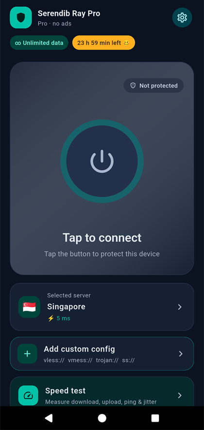
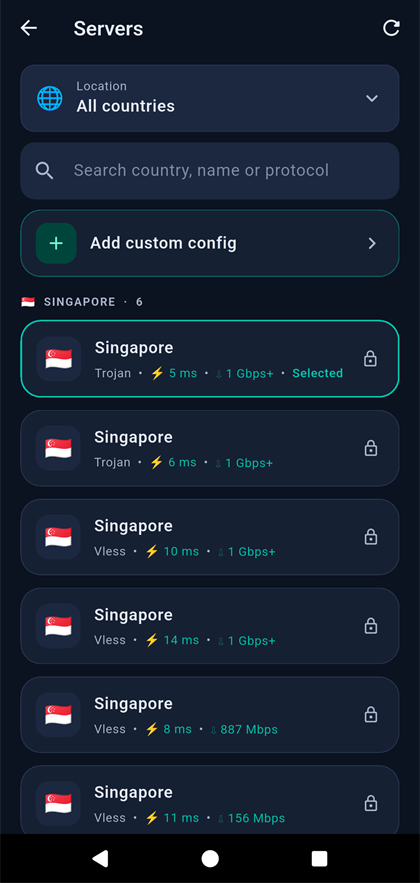

<div align="center">


# Serendib Ray

### A fast, simple V2Ray / Xray VPN client for Windows, macOS and Android

Servers re-tested every 6 hours &nbsp;·&nbsp; fastest first &nbsp;·&nbsp; no ads &nbsp;·&nbsp; made in Sri Lanka 🇱🇰

<a href="https://github.com/Dinith-k/serendib-ray-downloads/releases/latest"></a>


<br>

<a href="https://github.com/Dinith-k/serendib-ray-downloads/releases/download/v0.4.0/Serendib-Ray-Setup-0.4.0.exe"></a>
<a href="https://github.com/Dinith-k/serendib-ray-downloads/releases/download/v0.4.0/Serendib-Ray-0.4.0-mac-arm64.dmg"></a>
<a href="https://github.com/Dinith-k/serendib-ray-downloads/releases/download/v0.4.0/Serendib-Ray-Pro-1.0.0.apk"></a>

<sub>Mac with an Intel chip? <a href="https://github.com/Dinith-k/serendib-ray-downloads/releases/download/v0.4.0/Serendib-Ray-0.4.0-mac-x64.dmg">Get the Intel version</a> &nbsp;·&nbsp; <a href="https://github.com/Dinith-k/serendib-ray-downloads/releases/latest">All files and checksums</a></sub>

</div>

> [!NOTE]
> These apps need an **activation key** (it looks like `SRK-XXXXX-XXXXX-XXXXX-XXXXX`). This page only holds the downloads. If you don't have a key, ask whoever gave you the app.

---

## ✨ Why Serendib Ray

| 🚀 Fastest first | 🧪 Tested servers | 🔑 Your plan, in the app |
|:--|:--|:--|
| Servers are listed from fastest to slowest, with the latest speed test shown next to each one, so the best one is always on top. | Only servers that were tested and still work are listed, and they are re-tested every 6 hours. | See your plan, how much time is left and a summary of your usage, right in the app. |

| 🎯 Port 443 mode | 🧭 Your choice of server | 🚫 No ads |
|:--|:--|:--|
| One switch keeps only servers on port 443, which networks that block other ports usually still allow. Off by default. | Pick a country, or add your own `vless://` `vmess://` `trojan://` `ss://` links. | No ads in any of the apps, and no ad code inside the Android Pro app. |

### What each app has

| | 🪟 Windows | 🍎 macOS | 🤖 Android (Pro) |
|:--|:-:|:-:|:-:|
| Activation key, one key per device | ✅ | ✅ | ✅ |
| Tested server list, fastest first | ✅ | ✅ | ✅ |
| Latest speed test next to each server | ✅ | ✅ | ✅ |
| Plan, time left and usage summary | ✅ | ✅ | ✅ |
| Only servers on port 443 | ✅ | ✅ | ✅ |
| Add your own configs | ✅ | ✅ | ✅ |
| **Test all** from your own connection | ✅ | ✅ | ➖ |
| Starts with Windows and connects by itself | ✅ | ➖ | ➖ |
| No ads | ✅ | ✅ | ✅ |

---

## 📲 Download

| | Platform | File | Size | Needs |
|:-:|:--|:--|--:|:--|
| 🪟 | **Windows** | [Serendib-Ray-Setup-0.4.0.exe](https://github.com/Dinith-k/serendib-ray-downloads/releases/download/v0.4.0/Serendib-Ray-Setup-0.4.0.exe) | 122 MB | Windows 10 or 11, 64-bit |
| 🍎 | **macOS, Apple silicon** | [Serendib-Ray-0.4.0-mac-arm64.dmg](https://github.com/Dinith-k/serendib-ray-downloads/releases/download/v0.4.0/Serendib-Ray-0.4.0-mac-arm64.dmg) | 142 MB | Mac with M1, M2, M3 or M4 |
| 🍎 | **macOS, Intel** | [Serendib-Ray-0.4.0-mac-x64.dmg](https://github.com/Dinith-k/serendib-ray-downloads/releases/download/v0.4.0/Serendib-Ray-0.4.0-mac-x64.dmg) | 151 MB | Mac with an Intel chip |
| 🤖 | **Android, Serendib Ray Pro** | [Serendib-Ray-Pro-1.0.0.apk](https://github.com/Dinith-k/serendib-ray-downloads/releases/download/v0.4.0/Serendib-Ray-Pro-1.0.0.apk) | 67 MB | Android 7.0 or newer |

Not sure which Mac you have? Apple menu > **About This Mac**: "Chip: Apple M…" is Apple silicon, "Processor: Intel…" is Intel.

## 🚀 Get started in four steps

1. **Download** the file for your device from the table above.
2. **Install** it (the steps for each device are just below).
3. **Enter your activation key** when the app asks.
4. **Press connect.** Your traffic is now going through the fastest server.

---

## 📖 Install guides

<details>
<summary><b>🪟 Windows</b></summary>

<br>

1. Run the downloaded file and follow the steps. It installs just for you, with no administrator rights needed.
2. If Windows says it protected your PC, choose **More info**, then **Run anyway**. The installer is not code-signed yet, so Windows does not know the publisher (**Aplogon**).
3. On the last page, leave **Run on startup and connect automatically** ticked if you want it to start by itself when you sign in. You can turn it off any time in **Settings**.
4. Enter your activation key.

The close button asks whether to **minimize to the tray** or **quit**, and the tray icon can connect, disconnect and quit.

</details>

<details>
<summary><b>🍎 macOS</b></summary>

<br>

1. Open the downloaded `.dmg` and drag **Serendib Ray** into **Applications**.
2. The first time, open it with **right-click > Open**, then **Open** again. The app is not notarized by Apple yet, so a plain double-click shows a warning.
3. Enter your activation key.

> [!WARNING]
> **Early build.** The macOS version has passed its automated tests on a Mac, but it is new. If macOS asks for your password when connecting, that is it changing the network proxy settings.

</details>

<details>
<summary><b>🤖 Android (Serendib Ray Pro)</b></summary>

<br>

1. Open this page on your phone and download the `.apk`.
2. Open the downloaded file. Android asks you to allow installing apps from this source (your browser or Files app): allow it, go back, then tap **Install**.
3. Open **Serendib Ray Pro** and enter your activation key.
4. Tap the power button. Android asks once for permission to set up the VPN connection: choose **OK**.

Pro is the ad-free version of Serendib Ray. It is not on Google Play, so you install it from this file. It installs **next to** the free Serendib Ray app and does not replace it.

<p align="center">
  
  &nbsp;&nbsp;&nbsp;
  
</p>

</details>

---

## ❓ Questions

<details>
<summary><b>Where do I get an activation key?</b></summary>

<br>

From whoever gave you the app. Keys are given out by the person who runs the service, so there is no sign-up form here.

</details>

<details>
<summary><b>Can I use one key on two devices?</b></summary>

<br>

No. A key works on one device. To move it to a new phone or computer, ask for it to be reset, then enter it on the new device. Reinstalling the app on the same device normally needs no reset; wiping a phone to factory settings counts as a new device.

</details>

<details>
<summary><b>Does it work without internet access to the key server?</b></summary>

<br>

The app checks your key at start and every few hours. If it can't reach the server it keeps working for up to 3 days, then asks to check in again. A key that was disabled or has run out locks the app the next time it checks.

</details>

<details>
<summary><b>Is the Pro app the same as the Serendib Ray on Google Play?</b></summary>

<br>

No, it is a separate app (**Serendib Ray Pro**) with the same look. It has no ads and uses an activation key and the tested server list. You can keep both installed.

</details>

<details>
<summary><b>Android warns me about installing from outside Google Play</b></summary>

<br>

That is normal for any app that is not from the store. The file is signed by **Aplogon**; you can compare its checksum with the one on this page (see *Check your download* below).

</details>

---

## 🔒 Privacy

About how you use the app, only **totals** are sent to vpnlk.online: the time you were connected, the amount of data, the number of connections and the country of the last server. The sites you visit, the addresses you open and what you do online are never sent. Read the full text at [vpnlk.online/privacy](https://vpnlk.online/privacy).

## ✅ Check your download

Checksums are in [SHA256SUMS.txt](https://github.com/Dinith-k/serendib-ray-downloads/releases/download/v0.4.0/SHA256SUMS.txt). The result should match the line for your file.

```powershell
# Windows
certutil -hashfile Serendib-Ray-Setup-0.4.0.exe SHA256
```

```bash
# macOS
shasum -a 256 Serendib-Ray-0.4.0-mac-arm64.dmg
```

<details>
<summary>Android: check who signed the APK</summary>

<br>

With the Android SDK tools: `apksigner verify --print-certs Serendib-Ray-Pro-1.0.0.apk`. The signer is **CN=Aplogon** and its certificate SHA-256 is:

```
195ffebc367325d9e3bb72d9629772c02ef24762c4c3ffa7363608e85ba65b36
```

</details>

---

<div align="center">

<sub>Serendib Ray by <b>Aplogon</b> &nbsp;·&nbsp; <a href="https://vpnlk.online">vpnlk.online</a> &nbsp;·&nbsp; <a href="https://vpnlk.online/privacy">Privacy</a></sub>

</div>
